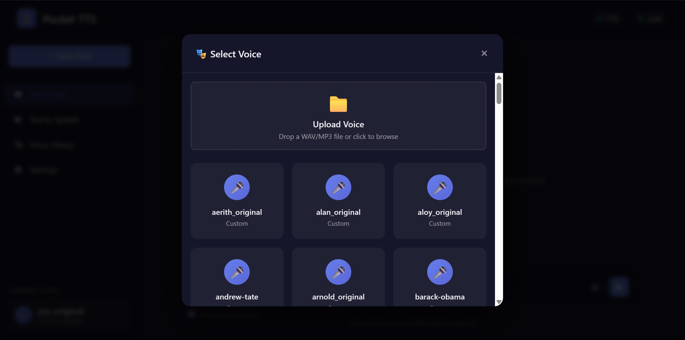
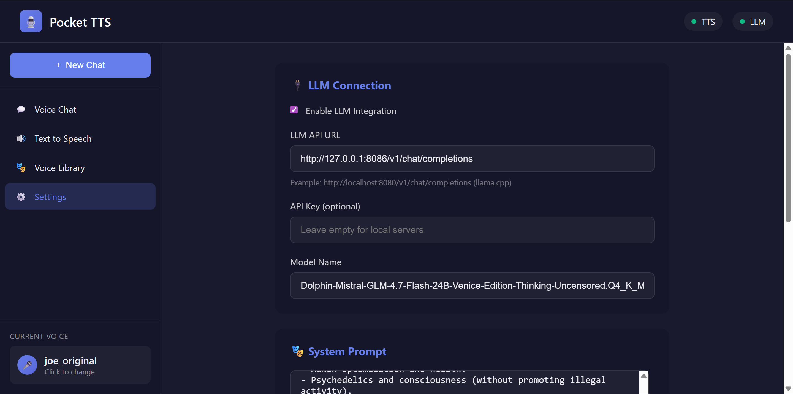

# 🎙️ Pocket TTS Server v1.0

[](https://github.com/ai-joe-git/pocket-tts-server)


A lightweight, real-time voice cloning and chat server with OpenAI-compatible API. Clone any voice with just 20 seconds of audio and chat with AI using that voice instantly.

**[📥 Download](https://github.com/ai-joe-git/pocket-tts-server) | [🐛 Report Issue](https://github.com/ai-joe-git/pocket-tts-server/issues) | [⭐ Star](https://github.com/ai-joe-git/pocket-tts-server)**

---

## ✨ Screenshots

### Voice Chat Interface

*Real-time voice chat with streaming text and audio*

### Voice Library & Upload

*Upload voices via drag-and-drop or browse. Auto-converts MP3/OGG/FLAC to WAV.*

### LLM Configuration

*Easy configuration for any OpenAI-compatible LLM backend*

---

## 🚀 Quick Start (Windows - 3 Steps)

### Step 1: Install
Double-click **`install_pocket_tts.bat`**
- Installs Python (if needed)
- Creates virtual environment
- Installs all dependencies automatically

### Step 2: Run
Double-click **`run_pocket_tts.bat`**
- Starts the server
- Opens browser automatically (or go to `http://localhost:8000`)

### Step 3: Chat
- Select a voice from the sidebar
- Go to **Voice Chat**
- Start typing!

**That's it!** No coding required.

---

## 🎭 Key Features

### 🗣️ Voice Cloning
- **Any voice** - Upload 15-20 seconds of clear audio
- **Auto-conversion** - MP3/OGG/FLAC → WAV automatically
- **Smart trimming** - Long audio auto-trimmed to 20s (prevents gibberish)
- **Archive system** - Originals saved to `voices-celebrities-archive/`

### 💬 Real-Time Voice Chat
- **Streaming text** - Words appear as LLM generates them
- **Streaming audio** - Audio plays sentence-by-sentence
- **No waiting** - First audio in 2-3 seconds
- **Sequential playback** - Sentences queue and play in order

### 🔌 OpenAI Compatible
- Drop-in replacement for OpenAI TTS API
- Works with OpenWebUI, SillyTavern, and other clients
- `/v1/audio/speech`, `/v1/chat/completions`, `/v1/audio/voices`

### ⚡ Performance
- 4000 token support for long responses
- 180-second timeout for slow LLMs
- CPU optimized (GPU optional); **Intel Arc** via XPU supported — see [INTEL_ARC.md](INTEL_ARC.md)
- **Piper** voice models supported (optional) — see [PIPER.md](PIPER.md)
- **Wyoming** protocol for [Home Assistant](https://www.home-assistant.io/integrations/wyoming/) — see [WYOMING.md](WYOMING.md)
- 76+ voices included (celebrities, characters, custom)

---

## 📋 Requirements

### Automatic (Windows)
Just run `install_pocket_tts.bat` - handles everything!

### Manual Installation
```bash
# 1. Clone repository
git clone https://github.com/ai-joe-git/pocket-tts-server.git
cd pocket-tts-server

# 2. Install dependencies
pip install -r requirements.txt

# 3. Start server
python pocket_tts_api.py
```

**System Requirements:**
- Windows 10/11 (Linux/Mac supported with manual setup)
- Python 3.8+
- 4GB+ RAM
- Audio: WAV, MP3, OGG, FLAC supported

### Hugging Face access (Pocket TTS model)

The Pocket TTS model is hosted on Hugging Face. You must **accept the model terms** and **log in** before the first run so the server can download the model.

1. **Authorize the model:** Open [https://huggingface.co/kyutai/pocket-tts](https://huggingface.co/kyutai/pocket-tts), sign in or create an account, and accept the conditions to access the repository.
2. **Log in from the command line:**  
   - Install [uv](https://docs.astral.sh/uv/) if you don’t have it (e.g. `pip install uv` or see [uv installation](https://docs.astral.sh/uv/getting-started/installation/)).  
   - Run:  
     `uvx hf auth login`  
   - Follow the prompts to authenticate. After that, the Pocket TTS server can download the model on first start.

---

## 🎤 Setting Up Voices

### Method 1: Web Upload (Easiest)
1. Open `http://localhost:8000`
2. Click **Voice Library** or current voice in sidebar
3. Drag & drop audio file or click to browse
4. Name your voice
5. Done! Ready in seconds

### Method 2: Manual Copy
- **Your own voices:** Copy audio files to `voices-pockettts/` (same folder used for web uploads).
- **Optional pre-made pack:** Copy to `voices-celebrities/` if you use that folder.
2. Restart server (or new files are picked up on next scan).
3. Files auto-convert to WAV; originals archived to `*-archive/` folders.

### Method 3: Download voices from Hugging Face (kyutai/tts-voices)
You can download the official Kyutai TTS voice pack into `voices-pockettts/` (subfolders are scanned automatically).

1. **Upgrade Hugging Face Hub** (recommended):
   ```bash
   pip install --upgrade huggingface_hub
   ```
2. **Log in** if required (same as for the Pocket TTS model): `uvx hf auth login`
3. **Download the voice repo** into the server folder:
   ```bash
   python -c "from huggingface_hub import snapshot_download; snapshot_download(repo_id='kyutai/tts-voices', local_dir='./voices-pockettts', local_dir_use_symlinks=False)"
   ```
4. Restart the server. Voices from all subfolders under `voices-pockettts/` will be listed.

After the download, `voices-pockettts/` contains subfolders (e.g. `alba-mackenna`, `cml-tts`, `ears`, `expresso`, `vctk`, `voice-donations`, etc.). For a description of each voice set, see **`voices-pockettts/README.md`** or the repo: [kyutai/tts-voices on Hugging Face](https://huggingface.co/kyutai/tts-voices).

**Voice Quality Tips:**
- ✅ **Best length:** 15-20 seconds
- ✅ **Max length:** 20 seconds (longer files auto-trimmed)
- ✅ **Clear audio:** Single speaker, no background noise
- ✅ **Why trim?** Prevents gibberish from overly long samples

---

## 🤖 Connecting to LLM

### Recommended: llama.cpp

**1. Start LLM server:**
```bash
./server -m your-model.gguf -c 4096 --port 8080
```

**2. Configure Pocket TTS:**
- Open web interface
- Go to **Settings** tab
- Enable **LLM Integration**
- Set URL: `http://127.0.0.1:8080/v1/chat/completions`
- Save

**3. Start chatting:**
- Select **Voice Chat** tab
- Type message
- Watch text stream in real-time
- Hear voice respond immediately!

**Other LLM Options:**
- Ollama (`http://localhost:11434/v1/chat/completions`)
- text-generation-webui
- Any OpenAI-compatible API

---

## 📚 API Documentation

### Generate Speech
```bash
curl -X POST http://localhost:8000/v1/audio/speech \
  -H "Content-Type: application/json" \
  -d '{
    "input": "Hello, this is a test!",
    "voice": "barack-obama",
    "response_format": "wav"
  }' \
  --output speech.wav
```

### List Voices
```bash
curl http://localhost:8000/v1/audio/voices
```

Response:
```json
{
  "voices": [
    {"voice_id": "barack-obama", "name": "Barack Obama"},
    {"voice_id": "donald-trump", "name": "Donald Trump"}
  ]
}
```

### Voice Chat (Non-Streaming)
```bash
curl -X POST http://localhost:8000/v1/chat/completions \
  -H "Content-Type: application/json" \
  -d '{
    "messages": [{"role": "user", "content": "Tell me a joke"}],
    "voice": "elon-musk"
  }'
```

### Voice Chat (Streaming - Real-Time)
```bash
curl -X POST http://localhost:8000/v1/chat/completions/stream \
  -H "Content-Type: application/json" \
  -d '{
    "messages": [{"role": "user", "content": "Tell me a story"}],
    "voice": "donald-trump"
  }'
```

**SSE Response Format:**
- `data: {"type": "text", "content": "word "}` - Streaming text
- `data: {"type": "audio", "data": "base64...", "chunk": 0}` - Audio per sentence  
- `data: {"type": "done"}` - Complete

---

## 🛠️ Configuration

Edit `config.json` or use Settings page:

```json
{
  "server": {
    "host": "localhost",
    "port": 8000
  },
  "paths": {
    "voices_dir": "voices-celebrities",
    "voices_pockettts_dir": "voices-pockettts"
  },
  "wyoming": {
    "enabled": false,
    "host": "0.0.0.0",
    "port": 10300
  },
  "tts": {
    "device": "cpu"
  },
  "llm": {
    "enabled": true,
    "api_url": "http://127.0.0.1:8080/v1/chat/completions",
    "api_key": "",
    "model": "llama-3",
    "system_prompt": "You are a helpful AI assistant."
  }
}
```

---

## 🔧 Troubleshooting

### ❌ No Audio Output
- [ ] Check voice selected in sidebar
- [ ] Verify files in `voices-celebrities/` folder
- [ ] Check browser console (F12) for errors
- [ ] Restart server after adding voices

### ❌ Text Gets Cut Off
- [ ] This was fixed in v1.0 (4000 token limit)
- [ ] Check if your LLM has its own token limit

### ❌ Audio Sounds Weird/Garbled  
- [ ] Voice sample too long - check `voices-celebrities-archive/`
- [ ] Re-upload 15-20 second clip
- [ ] Ensure single speaker, clear audio

### ❌ LLM Connection Fails
- [ ] Verify LLM server running on correct port
- [ ] Check API URL matches your LLM (Settings page)
- [ ] Timeout is 180s - increase if needed

---

## 📁 Project Structure

```
pocket-tts-server/
├── pocket_tts_api.py           # Main server (FastAPI)
├── templates/
│   └── index.html              # Web interface
├── voices-pockettts/          # User uploads (Pocket TTS WAV)
├── voices-celebrities/        # Optional pre-made voices (WAV)
├── voices-*-archive/          # Archived originals after conversion
├── config.json                 # Settings
├── requirements.txt            # Python dependencies
├── install_pocket_tts.bat      # Windows installer
├── run_pocket_tts.bat          # Windows launcher
└── fix_dependencies.bat        # Repair tool
```

---

## 🎯 How It Works

### Streaming Architecture
1. **User sends message** → LLM starts generating
2. **Text streams** → Word-by-word as LLM generates
3. **Sentence complete** → TTS generates audio for that sentence
4. **Audio queues** → Plays sequentially (no overlap)
5. **Next sentence** → Continues while previous audio plays

### Voice Processing Pipeline
1. **Upload** → MP3/OGG/FLAC/WAV accepted
2. **Convert** → Auto-convert to WAV (24kHz, mono)
3. **Trim** → Cut to 20 seconds max (prevents gibberish)
4. **Archive** → Move original to archive folder
5. **Cache** → Load voice state for fast access

---

## 🤝 Contributing

Ideas for v1.1:
- 🎚️ Voice effects (pitch, speed, reverb)
- 🎭 Voice blending/mixing
- 🌐 Multi-language support
- 📱 Mobile app
- ⚡ WebRTC for ultra-low latency

**Open an issue** with feature requests or bugs!

---

## 📄 License

MIT License - Free for personal and commercial use.

---

## 🙏 Credits

- [pocket-tts](https://github.com/kyutai-labs/pocket-tts) - The TTS engine
- [FastAPI](https://fastapi.tiangolo.com/) - Web framework
- [llama.cpp](https://github.com/ggerganov/llama.cpp) - Recommended LLM backend

---

**Made with ❤️ by the AI community**

*Note: Not affiliated with OpenAI. API compatibility for convenience only.*

**[⬆️ Back to Top](#readme-top)**
